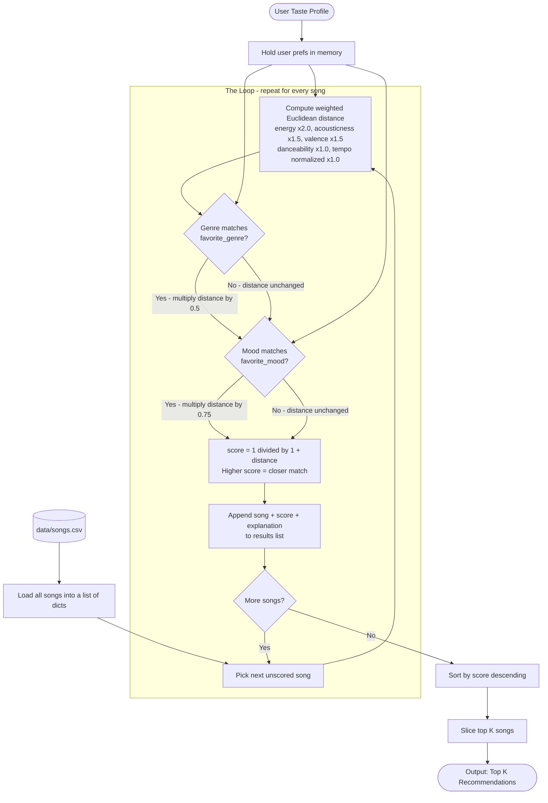
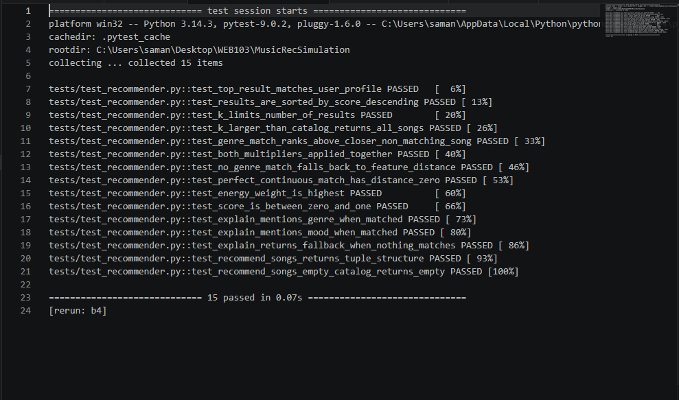
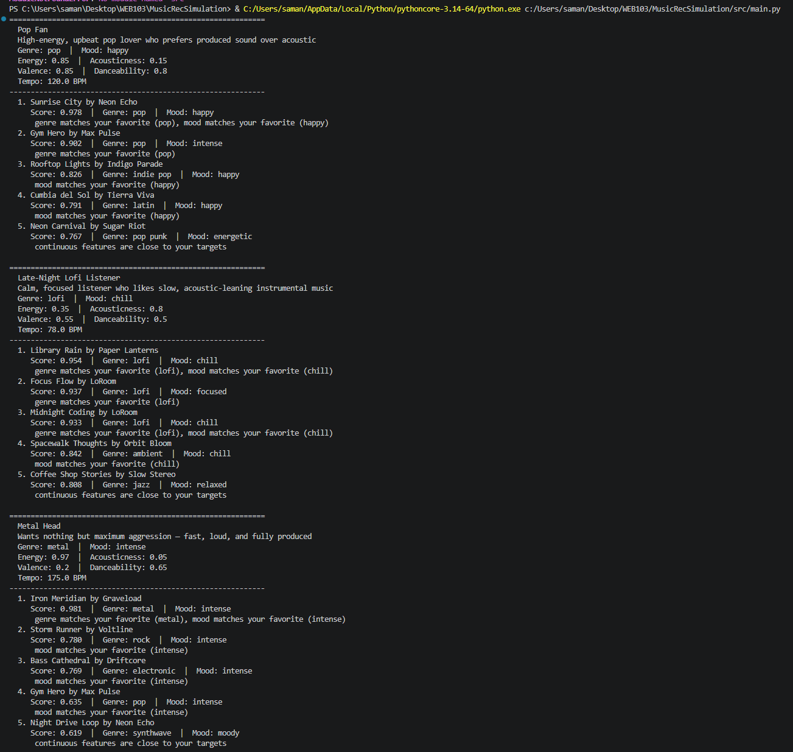

# 🎵 Music Recommender Simulation

## Project Summary

This project uses a simple, content-based filtering algorithm to recommend songs to users. In other words, it recommends songs that are acoustically/structurally similar to other songs the user has positively engaged with.

--- 

## How The System Works

Each song is assigned values for five continuous features: **energy**, **acousticness**, **valence**, **danceability**, and **tempo_bpm**. It is also tagged with a **genre** and a **mood**.

The user profile stores target values for each of those five features, plus a favorite genre and favorite mood:

| Profile field | Type | What it captures |
|---|---|---|
| `favorite_genre` | string | Preferred genre label (e.g. "pop") |
| `favorite_mood` | string | Preferred mood label (e.g. "happy") |
| `target_energy` | float 0–1 | How intense or calm the user likes songs |
| `target_acousticness` | float 0–1 | Preference for acoustic vs. produced sound |
| `target_valence` | float 0–1 | Preference for positive/upbeat vs. dark/melancholic |
| `target_danceability` | float 0–1 | Preference for rhythmic, dance-friendly tracks |
| `target_tempo_bpm` | float | Preferred beats per minute |

**Scoring a song** happens in two steps:

1. **Weighted Euclidean distance** — all five continuous features are compared between the song and the user's targets. Tempo is normalized to a 0–1 scale (divided by 200) so it doesn't dominate. Each feature carries a weight that reflects how perceptibly different it sounds to a listener:

   | Feature | Weight |
   |---|---|
   | energy | 2.0 |
   | acousticness | 1.5 |
   | valence | 1.5 |
   | danceability | 1.0 |
   | tempo (normalized) | 1.0 |

   A smaller distance means the song is a closer match.

2. **Genre and mood multipliers** — if a song's genre matches `favorite_genre`, its distance is halved (×0.5), making it rank much higher. If its mood matches `favorite_mood`, the distance is multiplied by ×0.75. These act as multipliers on the distance rather than arbitrary additive bonuses, so their effect scales proportionally with how different the song already is.

The final **score** converts distance to a 0–1 value using `1 / (1 + distance)`, where 1.0 is a perfect match and scores closer to 0 signal a poor fit. Songs are ranked from highest to lowest score and the top K are returned.

**Known limitations and biases**

- If a user's favorite genre or mood is not present in the catalog, those multipliers never apply and the ranking falls back to continuous-feature distance alone — silently.
- The feature weights above are designer assumptions, not values learned from real listening behavior. They will be a better fit for some users than others.
- The catalog is small and reflects a limited range of cultural perspectives; genres and moods not represented cannot be recommended.
- The system always returns the closest match and never introduces variety, which can create a filter bubble over time.

## Data Flow


**Tests**

**User Profiles**


## Getting Started

### Setup

1. Create a virtual environment (optional but recommended):

   ```bash
   python -m venv .venv
   source .venv/bin/activate      # Mac or Linux
   .venv\Scripts\activate         # Windows

2. Install dependencies

```bash
pip install -r requirements.txt
```

3. Run the app:

```bash
python -m src.main
```

### Running Tests

Run the starter tests with:

```bash
pytest
```

You can add more tests in `tests/test_recommender.py`.

---

## Experiments You Tried

Use this section to document the experiments you ran. For example:

- What happened when you changed the weight on genre from 2.0 to 0.5
- What happened when you added tempo or valence to the score
- How did your system behave for different types of users

---

## Limitations and Risks

Summarize some limitations of your recommender.

Examples:

- It only works on a tiny catalog
- It does not understand lyrics or language
- It might over favor one genre or mood

You will go deeper on this in your model card.

---

## Reflection

Read and complete `model_card.md`:

[**Model Card**](model_card.md)

Write 1 to 2 paragraphs here about what you learned:

- about how recommenders turn data into predictions
- about where bias or unfairness could show up in systems like this


---

## 7. `model_card_template.md`

Combines reflection and model card framing from the Module 3 guidance. :contentReference[oaicite:2]{index=2}  

```markdown
# 🎧 Model Card - Music Recommender Simulation

## 1. Model Name

Give your recommender a name, for example:

> VibeFinder 1.0

---

## 2. Intended Use

- What is this system trying to do
- Who is it for

Example:

> This model suggests 3 to 5 songs from a small catalog based on a user's preferred genre, mood, and energy level. It is for classroom exploration only, not for real users.

---

## 3. How It Works (Short Explanation)

Describe your scoring logic in plain language.

- What features of each song does it consider
- What information about the user does it use
- How does it turn those into a number

Try to avoid code in this section, treat it like an explanation to a non programmer.

---

## 4. Data

Describe your dataset.

- How many songs are in `data/songs.csv`
- Did you add or remove any songs
- What kinds of genres or moods are represented
- Whose taste does this data mostly reflect

---

## 5. Strengths

Where does your recommender work well

You can think about:
- Situations where the top results "felt right"
- Particular user profiles it served well
- Simplicity or transparency benefits

---

## 6. Limitations and Bias

Where does your recommender struggle

Some prompts:
- Does it ignore some genres or moods
- Does it treat all users as if they have the same taste shape
- Is it biased toward high energy or one genre by default
- How could this be unfair if used in a real product

---

## 7. Evaluation

How did you check your system

Examples:
- You tried multiple user profiles and wrote down whether the results matched your expectations
- You compared your simulation to what a real app like Spotify or YouTube tends to recommend
- You wrote tests for your scoring logic

You do not need a numeric metric, but if you used one, explain what it measures.

---

## 8. Future Work

If you had more time, how would you improve this recommender

Examples:

- Add support for multiple users and "group vibe" recommendations
- Balance diversity of songs instead of always picking the closest match
- Use more features, like tempo ranges or lyric themes

---

## 9. Personal Reflection

A few sentences about what you learned:

- What surprised you about how your system behaved
- How did building this change how you think about real music recommenders
- Where do you think human judgment still matters, even if the model seems "smart"

